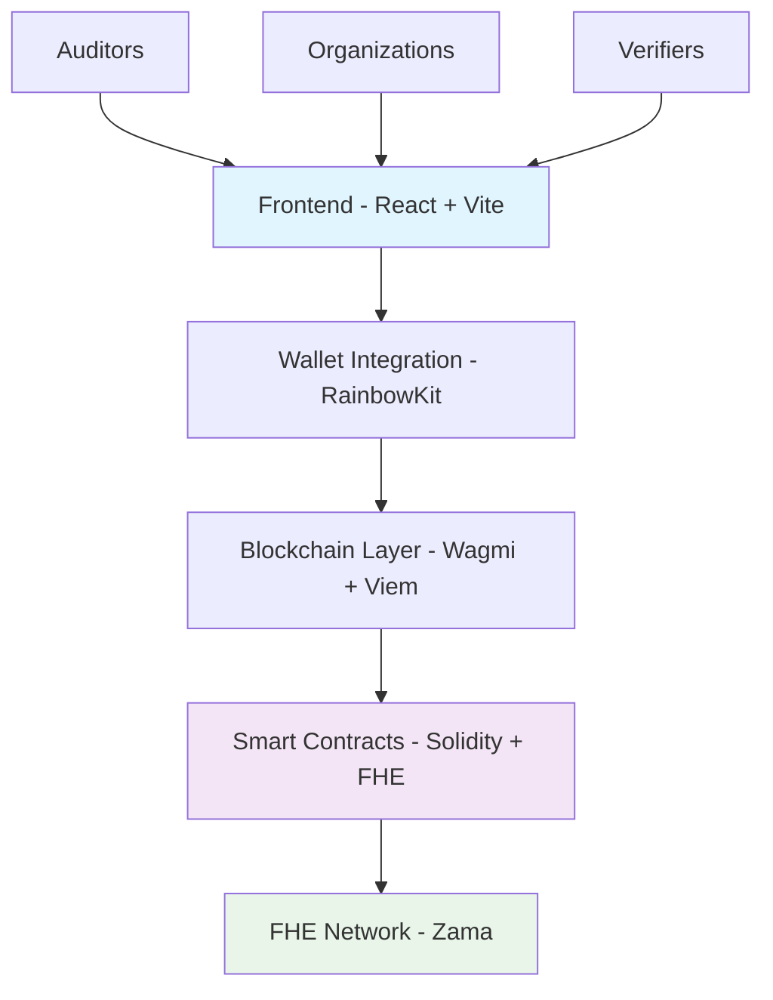

# 🛡️ AudityVault

> **Next-Generation Privacy-Preserving Compliance Platform**

[](https://opensource.org/licenses/MIT)
[](https://vitejs.dev/)
[](https://zama.ai/)

---

## 🌟 What Makes AudityVault Special?

AudityVault revolutionizes financial compliance through **Fully Homomorphic Encryption (FHE)**, enabling organizations to submit sensitive audit data while maintaining complete privacy. Our platform ensures that even the most confidential financial information remains encrypted throughout the entire verification process.

### 🔐 Core Innovation

- **Zero-Knowledge Verification**: Verify compliance without exposing raw data
- **FHE-Powered Encryption**: Process encrypted data without decryption
- **Decentralized Trust**: Blockchain-based immutable audit trails
- **Privacy-First Design**: Your data, your control, always encrypted

---

## 🚀 Quick Start

### Prerequisites

- **Node.js** 18+ and npm
- **Web3 Wallet** (MetaMask, Rainbow, etc.)
- **Sepolia ETH** for testnet interactions

### Installation

```bash
# Clone the repository
git clone https://github.com/ElenaOsinski/audity-vault.git
cd audity-vault

# Install dependencies
npm install

# Configure environment
cp env.example .env
# Edit .env with your configuration

# Start development server
npm run dev
```

### Environment Setup

Create a `.env` file with the following variables:

```env
# Blockchain Configuration
NEXT_PUBLIC_CHAIN_ID=11155111
NEXT_PUBLIC_RPC_URL=your_rpc_endpoint_here

# Wallet Integration
NEXT_PUBLIC_WALLET_CONNECT_PROJECT_ID=your_project_id_here

# Contract Addresses (after deployment)
NEXT_PUBLIC_AUDITY_VAULT_CONTRACT=your_contract_address_here

# FHE Configuration
NEXT_PUBLIC_FHE_NETWORK_URL=https://api.zama.ai
NEXT_PUBLIC_FHE_APP_ID=audity-vault
```

---

## 🏗️ Architecture Overview



### Technology Stack

| Layer | Technology | Purpose |
|-------|------------|---------|
| **Frontend** | React 18 + TypeScript + Vite | Modern, fast UI development |
| **UI Components** | shadcn/ui + Tailwind CSS | Beautiful, accessible components |
| **Blockchain** | Ethereum (Sepolia) | Decentralized infrastructure |
| **Encryption** | FHE via Zama | Privacy-preserving computation |
| **Wallet** | RainbowKit + Wagmi | Multi-wallet support |
| **Smart Contracts** | Solidity 0.8.24 | FHE-enabled contract logic |

---

## 🔧 Smart Contract Features

### AudityVault Contract

Our main contract implements the following core functionalities:

#### 📊 Audit Management
- **Encrypted Report Submission**: Submit audit data with FHE encryption
- **Privacy-Preserving Verification**: Verify reports without data exposure
- **Immutable Audit Trail**: All submissions recorded on blockchain

#### 👥 User Management
- **Auditor Registration**: Register and manage auditor credentials
- **Organization Profiles**: Create and maintain organization records
- **Reputation System**: Track and update user reputation scores

#### 🔍 Finding Management
- **Encrypted Findings**: Submit audit findings with severity levels
- **Resolution Tracking**: Track finding resolution status
- **Impact Assessment**: Assess and record finding impact

### Key Functions

```solidity
// Submit encrypted audit report
function submitAuditReport(
    address organization,
    string reportHash,
    string auditType,
    externalEuint32 riskScore,
    externalEuint32 complianceScore,
    externalEuint32 findingsCount,
    bytes inputProof
) external returns (uint256);

// Register new auditor
function registerAuditor(
    string name,
    string credentials,
    externalEuint32 initialReputation,
    bytes inputProof
) external returns (uint256);

// Verify audit report
function verifyAuditReport(uint256 reportId, bool isVerified) external;
```

---

## 🎯 Use Cases

### For Auditors
- Submit encrypted audit reports
- Manage audit findings and recommendations
- Track verification status and reputation
- Access comprehensive audit history

### For Organizations
- Submit compliance documents securely
- Monitor audit progress in real-time
- Access verification results privately
- Maintain encrypted compliance records

### For Compliance Officers
- Review and verify audit submissions
- Manage auditor credentials and reputation
- Generate compliance reports
- Monitor industry compliance trends

---

## 🔒 Security Features

### Privacy Protection
- **FHE Encryption**: All sensitive data encrypted using Fully Homomorphic Encryption
- **Zero-Knowledge Proofs**: Verify data integrity without exposing raw data
- **Decentralized Storage**: Audit data stored on blockchain for immutability
- **Multi-signature Verification**: Multiple auditors required for critical audits

### Data Integrity
- **Immutable Records**: All audit data permanently recorded on blockchain
- **Cryptographic Proofs**: Every submission includes cryptographic verification
- **Audit Trails**: Complete history of all audit activities
- **Tamper Detection**: Any attempt to modify data is immediately detectable

---

## 🚀 Deployment

### Smart Contract Deployment

```bash
# Install Hardhat
npm install --save-dev hardhat @nomicfoundation/hardhat-toolbox

# Deploy to Sepolia
npx hardhat run scripts/deploy.ts --network sepolia

# Verify contract
npx hardhat verify --network sepolia <CONTRACT_ADDRESS> <VERIFIER_ADDRESS>
```

### Frontend Deployment

See [VERCEL_DEPLOYMENT.md](./VERCEL_DEPLOYMENT.md) for detailed Vercel deployment instructions.

---

## 📈 Roadmap

### Phase 1: Core Platform ✅
- [x] FHE-enabled smart contracts
- [x] Multi-wallet integration
- [x] Basic audit submission and verification
- [x] Auditor and organization management

### Phase 2: Enhanced Features 🚧
- [ ] Multi-chain support (Polygon, Arbitrum)
- [ ] Advanced FHE operations
- [ ] AI-powered audit analysis
- [ ] Mobile application

### Phase 3: Enterprise Features 📋
- [ ] Integration with major compliance frameworks
- [ ] Enterprise dashboard features
- [ ] Advanced reporting and analytics
- [ ] API for third-party integrations

---

## 🤝 Contributing

We welcome contributions from the community! Here's how you can help:

### Development Setup
1. Fork the repository
2. Create a feature branch: `git checkout -b feature/amazing-feature`
3. Make your changes and add tests
4. Commit your changes: `git commit -m 'Add amazing feature'`
5. Push to the branch: `git push origin feature/amazing-feature`
6. Open a Pull Request

### Areas for Contribution
- **Smart Contract Development**: Enhance FHE functionality
- **Frontend Features**: Improve UI/UX components
- **Documentation**: Help improve our docs
- **Testing**: Add comprehensive test coverage
- **Security**: Audit and improve security measures

---

## 📄 License

This project is licensed under the MIT License - see the [LICENSE](LICENSE) file for details.

---

## 🆘 Support & Community

### Getting Help
- 📖 **Documentation**: Check our comprehensive docs
- 🐛 **Issues**: Report bugs on GitHub Issues
- 💬 **Discussions**: Join our community discussions
- 📧 **Contact**: Reach out to our team

### Community Links
- 🌐 **Website**: [audityvault.com](https://audityvault.com)
- 🐦 **Twitter**: [@audityvault](https://twitter.com/audityvault)
- 💼 **LinkedIn**: [AudityVault](https://linkedin.com/company/audityvault)
- 📺 **Discord**: [Join our community](https://discord.gg/audityvault)

---

## 🙏 Acknowledgments

- **Zama**: For FHE technology and support
- **RainbowKit**: For excellent wallet integration
- **Vite**: For the amazing build tool
- **shadcn/ui**: For beautiful UI components
- **Open Source Community**: For inspiration and support

---

<div align="center">

**Built with ❤️ by the AudityVault Team**

*Empowering privacy-preserving compliance for the decentralized future*

[](https://github.com/ElenaOsinski/audity-vault)
[](https://twitter.com/audityvault)

</div>